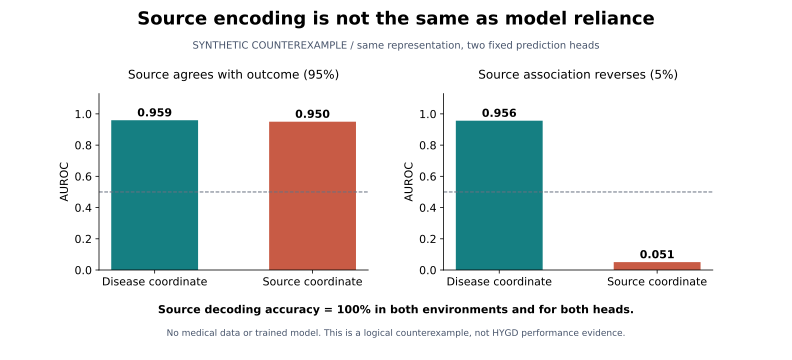

# HYGD scientific reassessment — September 2026

**Result:** the current evaluator now has a complete observed model run. The negative-control audit found a concrete exchangeability defect. Neither finding establishes transportability or a causal shortcut mechanism.

## What changed

The public baseline was commit `954be17aa11377b73b7810a067266bfe341ccd52`. It already had a duplicate-aware evaluator and 75 synthetic integrity tests, but its preferred numbers came from a retrospective analysis of a private legacy run. This reassessment executed the existing v5 recipe once, without choosing a new model or changing it in response to outer outcomes, and added descriptive probability diagnostics and two focused control investigations.

| Evidence | Before | Now |
| --- | --- | --- |
| Current v5 model execution | Not evidenced | Complete 5-fold × 10-epoch run, with terminal artifact verification |
| Internal ranking | Retrospective mean-fold AUROC 0.9908 | Fresh mean-fold AUROC 0.9908 [0.9790, 0.9990] |
| Thresholded group decisions | Legacy 97 TN / 3 FP / 8 FN / 175 TP | Fresh 97 TN / 3 FP / 4 FN / 179 TP |
| Probabilities | No dedicated descriptive report | Brier 0.0323; log loss 0.1254; mean-risk gap +2.68 percentage points |
| Shuffled-label control | High score, unexplained | Row shuffling breaks linked-subject label structure; magnitude still unexplained |
| Source-origin probe | Risk of conflating encoding and reliance | Explicit distinction, supported by an executable synthetic counterexample |

The different thresholded decisions are not a controlled comparison establishing model superiority. The old and new probabilities differ (mean absolute group-probability difference 0.000429), while all five fold AUROCs happen to agree. Both runs use the same historically informed recipe and data. Repeated evaluation does not create a new independent validation cohort.

## 1. A complete v5 model run

The [execution plan](results/v5_execution_plan_20260906.json) was saved locally before training. It binds the four execution-source files, the cached ResNet18 weight bytes and the recipe. All four code hashes matched after completion. The plan is published after execution; its local timestamp is **not** independently timestamped preregistration.

The unchanged recipe used 5 outer folds, 10 epochs, batch size 32, seed 20260711, 15% inner group validation, a 0.95 inner sensitivity target and 5,000 bootstrap replicates, on Apple MPS. The already-held HYGD v1.1.0 data and cached ImageNet weights were used. The process ran with network access denied. No dependency or weight was downloaded, and no outer score was disclosed until the terminal bundle.

- 747 input images; 737 unique hashes; 283 linked evaluation groups.
- Mean outer-fold group AUROC: **0.9908**, conditional 95% interval **[0.9790, 0.9990]**.
- Sensitivity **0.9781**; specificity **0.9700** at the separately selected inner-fold thresholds.
- Secondary pooled group AUROC **0.9904**; image AUROC **0.9836**.
- Complete source-result SHA-256: `a6010af08890dd936ed053490c4ca0afe14229f5c513418362772ead0360e034`.

The [aggregate run receipt](results/v5_complete_run_20260906.json) contains the verified metrics, source-artifact commitments, runtime versions and descriptive diagnostics. The exporter rechecks the terminal audit, canonical group/fold identity, hashes, sizes and OOF-derived metrics. It verifies retained evidence; it does not independently attest an execution date or prove the model was trained honestly. Training was observed in this reassessment; the private run log and pre/post source checks support that report.

Intervals condition on these frozen predictions and fixed folds. They omit retraining, recipe, checkpoint and threshold-selection uncertainty. Supplied linked groups do not establish biological-subject independence. No external target was accessed.

## 2. Probability and operating-point diagnostics

The group-level mean predicted risk is **0.6735**, versus observed frequency **0.6466**. This is an average risk gap, not a fitted calibration intercept. Brier score and log loss assess overall probabilistic accuracy; neither isolates calibration. Sparse reliability bins with fewer than ten groups suppress their count, outcome and score summaries. This reporting rule is not a formal privacy guarantee.

| Operating point | TN | FP | FN | TP | Sensitivity | Specificity |
| --- | ---: | ---: | ---: | ---: | ---: | ---: |
| Recorded inner-selected thresholds (primary) | 97 | 3 | 4 | 179 | 0.9781 | 0.9700 |
| Fixed 0.5 (descriptive comparator) | 90 | 10 | 1 | 182 | 0.9945 | 0.9000 |

The two points were specified before inspecting the completed run. They describe a false-negative/false-positive tradeoff; neither is selected here for clinical use. Recorded thresholds span **0.485–0.824**. Threshold variation alone does not prove probability miscalibration. No recalibration, threshold search, decision-curve claim or clinical utility study was performed. [scikit-learn calibration guidance](https://scikit-learn.org/stable/modules/calibration.html) distinguishes proper scoring rules from calibration itself; [TRIPOD+AI](https://www.bmj.com/content/385/bmj-2023-078378) distinguishes discrimination, calibration and clinical utility.

## 3. What the historical negative control actually shuffled

The historical CEXT function permutes training labels within each source **by image row**. It does not exchange whole subjects or paired-eye label vectors. Replaying only that shuffle (no model fitting) reproduced the following changes:

| Held-out source | Training source | Originally consistent groups made mixed-label |
| --- | --- | ---: |
| HYGD | PAPILA | 65 |
| PAPILA | HYGD | 112 |
| RIM-ONE | HYGD | **100** |
| RIM-ONE | PAPILA | **53** |

See the [aggregate structure audit](results/negative_control_structure_20260906.json), which binds the original fold CSVs and historical evaluator by hash. PAPILA already contained seven paired-eye groups with discordant labels; the analysis distinguishes these from previously consistent groups broken by shuffling. RIM-ONE's supplied clusters contain one row each, with actual subject independence unproved.

**Consequence:** the historical control is a single image-row training-label perturbation, not a subject-exchangeable permutation null. Its unusual AUROC remains an exploratory warning. This audit does **not** show that the exchangeability defect caused the high score, that there was train/test leakage, or that the disease signal is purely a shortcut.

A future null must specify exchangeability, the evaluation unit, the retained nuisance associations and enough prespecified draws. [Ojala and Garriga](https://www.jmlr.org/papers/v11/ojala10a.html) discuss classifier permutation tests; [Winkler et al.](https://pmc.ncbi.nlm.nih.gov/articles/PMC4010955/) explain why dependence requires a justified block design. This is a methodological application of those principles, not a claim that their methods have been validated for these particular cohorts.

`validation/permutation_controls.py` supplies a tested block-vector primitive for a separately designed future study. It requires explicit matching slots (e.g. left/right eye), preserves whole ordered vectors within source/slot signatures and rejects ambiguous blocks. It does not prove exchangeability, handle every unequal-repeat design, fit models or compute p-values. Using patient IDs as scikit-learn's `permutation_test_score(groups=...)` would permute **within** patients; it is not the same as exchanging patient blocks. [Official API contract](https://scikit-learn.org/stable/modules/generated/sklearn.model_selection.permutation_test_score.html).

## 4. A frozen random-direction diagnostic

A [separate local plan](results/representation_geometry_protocol_20260906.json) fixed 1,024 isotropic Gaussian directions, seed 20260906, directional AUROC quantiles and the 0.75/0.25 reporting thresholds before these scores were computed. It used only the existing, hash-verified 384-dimensional DINOv2 features. Each dataset was analyzed separately, with no fitting, sign choice, selected best direction, new feature extraction or mixed-source training.

| Source | Evaluation rows | Central 95% of directional AUROCs | Directions with AUROC ≥0.75 |
| --- | ---: | --- | ---: |
| HYGD | 283 | 0.143–0.869 | 137/1024 (13.4%) |
| PAPILA | 420 | 0.301–0.692 | 4/1024 (0.4%) |
| RIMONE | 485 | 0.260–0.721 | 15/1024 (1.5%) |

HYGD uses mean features per linked group; PAPILA uses eye rows; RIM-ONE uses image rows. The quantities describe random directions conditional on those fixed data, with no resampling of patients. [Full aggregate output](results/representation_geometry_20260906.json).

**Interpretation:** high AUROC is possible for some directions without fitting their coefficients to labels. In RIM-ONE this occurred in 15/1024 directions. This makes a high score from one perturbation worth investigating through an actual null distribution rather than interpreting it in isolation. Random directions and classifiers refitted to shuffled labels need not have the same distribution; **15/1024 is not a p-value** for the historical control. This does not identify the exact mechanism of its 0.7468 AUROC. The feature coordinate system, pretrained representation and scaling matter; these were not optimized.

## 5. Why source encoding is not causal reliance

[ShorT](https://www.nature.com/articles/s41467-023-39902-7) shows why encoding a potentially sensitive/source attribute does not, by itself, establish harmful model reliance. The existing HYGD origin-probe gate remains a failed predeclared gate; it cannot be retroactively reinterpreted as a pass. Its 0.9994 accuracy directly establishes source decodability, not the causal mechanism of the disease classifier.



This figure is generated entirely from synthetic data. Two fixed heads share the same representation: one reads its disease coordinate and the other its source coordinate. Source decoding is perfect for both. After reversing the constructed source/outcome association, disease-head AUROC remains about 0.956 and source-head AUROC falls to 0.051. No medical model or dataset is used. This is an illustrative counterexample, not a new medical result or a novelty claim.

```bash
# Requires only the existing lightweight scientific dependencies; no dataset.
python examples/shortcut_counterexample.py
# Optional static figure; requires the project's existing Matplotlib dependency.
python examples/shortcut_counterexample.py --figure /tmp/hygd-counterexample.svg
```

## Reproduction and verification

Verification included the full synthetic suite and a separate NumPy calculation of pairwise AUROC, all 5,000 bootstrap replicates, Brier score and log loss. All matched. Each of the 3,072 directional AUROCs was also checked with scikit-learn independently of the production rank formula. Three isolated-copy mutations (threshold equality, row shuffling instead of block exchange, and outcome-based direction reversal) were detected. These are deterministic cross-checks by the same main agent, not independent human or agent peer review.

```bash
python -m unittest discover -s validation -p 'test_*.py' -v
# After obtaining HYGD v1.1.0 yourself into data/raw/:
python validation/internal_evaluation_repair.py --device mps \
  --output-prefix results/internal_evaluation_repair_my_run
# Compute your own completed result's SHA-256, then export aggregates:
python validation/summarize_completed_run.py \
  --result results/internal_evaluation_repair_my_run.json \
  --expected-result-sha256 YOUR_OWN_RESULT_SHA256
```

The private raw-data location differed on the observed machine; the scientific defaults above are unchanged. Another device/runtime may produce different probabilities and thresholds. A new complete run need not match the private result hash. `--verify-summary results/v5_complete_run_20260906.json` is intended for the exact bound private bundle, not a different run. The two diagnostic APIs accept explicitly prepared matrices/group tables; reproduction of the cross-source geometry and control-structure numbers requires the bound private source artifacts, which are not distributed. Only the synthetic demonstration is immediately dataset-free.

## The next step worth doing

Prioritize a **prospectively designed control study**, before another backbone. Its question is whether the actual disease prediction rule changes when a justified nuisance factor changes while clinically relevant anatomy is preserved. It needs an ophthalmologist-adjudicated factor/endpoint, usable independent units, a fully specified block null with adequate draws, appropriate data rights and a genuinely untouched evaluation route.

The existing [RIM-ONE terms](https://github.com/miag-ull/rim-one-dl) require its specified partitions and instruct users not to add images from other databases for training/tuning. No new mixed-source fit was performed here. Compatibility must be resolved before such a study. A model swap, a passing synthetic suite or a high internal AUROC does not supply the missing evidence.

The September reassessment closes with a complete internal execution and better control methodology. It does not reopen Lock B, revise historical protocol verdicts, establish external validity, or authorize clinical use.
