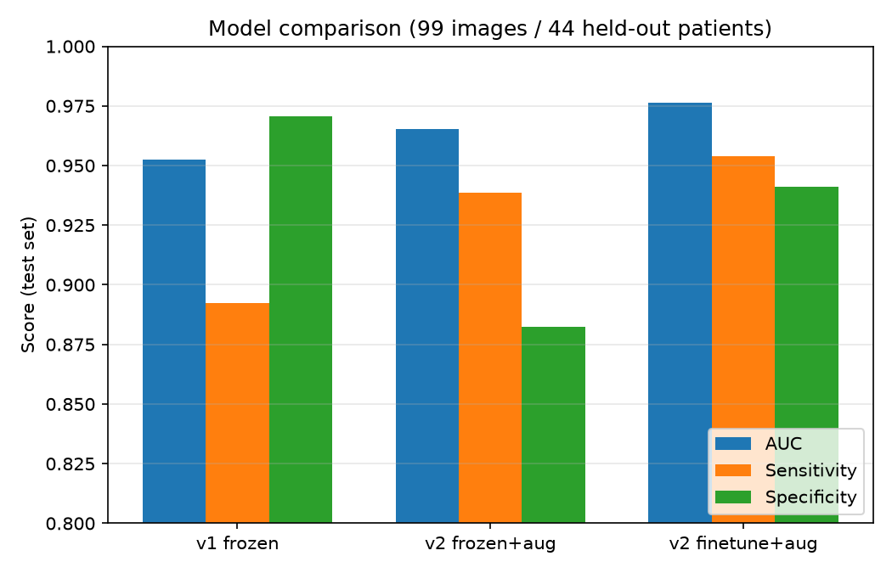
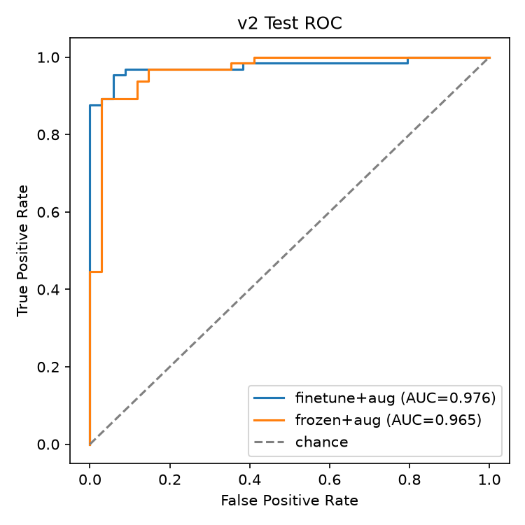
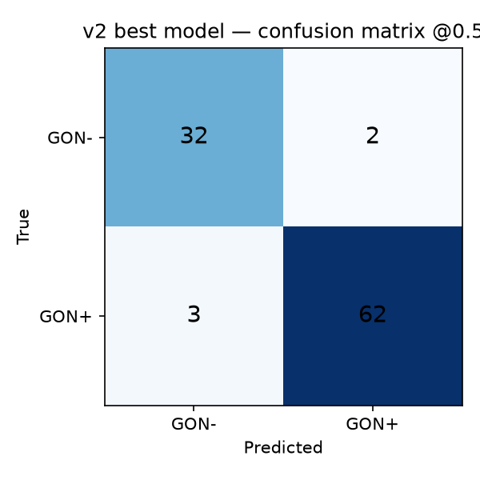
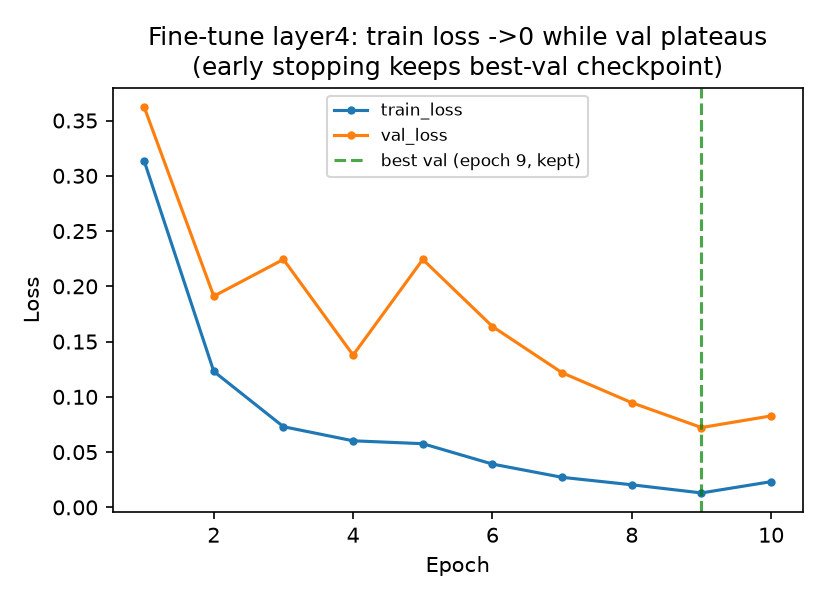
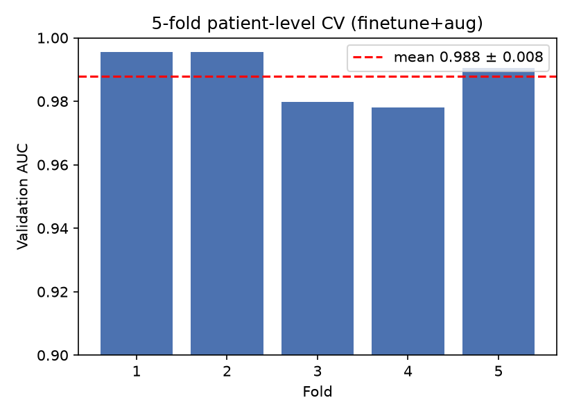
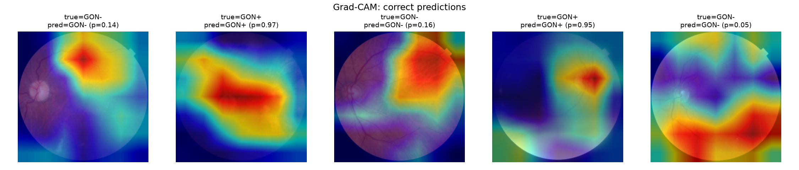
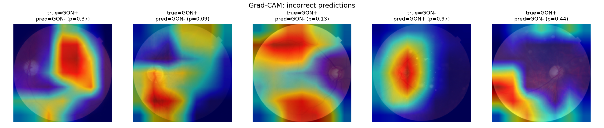
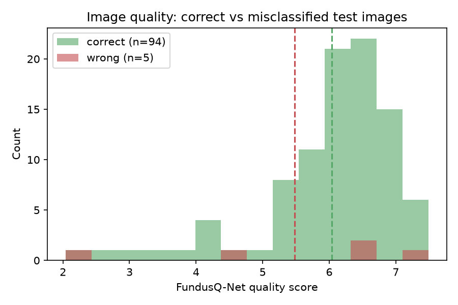

# HYGD Glaucoma Detection from Fundus Images: Baseline Classification, Explainability, and Clinical Error Analysis

> Status: **baseline + improved models trained, evaluated, and stress-tested** (2026-07-05): patient-level split, class-imbalance handling, three model configurations compared, 5-fold patient-level cross-validation, bootstrap 95% confidence intervals, a screening-oriented decision-threshold analysis, and Grad-CAM explainability.
>
> 📋 **[VALIDATION.md](VALIDATION.md) — why these numbers are honest, and the external-validation result: the model does NOT generalize to other datasets (in-distribution AUROC 0.988 → ~0.5 zero-shot on PAPILA).** Read this before trusting the AUC.

## 1. Clinical context

Glaucoma is a leading cause of irreversible blindness worldwide. It is often asymptomatic until significant, permanent optic nerve damage has already occurred, which makes photographic screening of the optic disc (via fundus imaging) a clinically important early-detection tool — a cheap, non-invasive image that a model can flag for a human specialist to review, not replace.

## 2. Project objective

Build a clean, reproducible baseline classifier for glaucoma detection from retinal fundus images, paired with an honest explainability and clinical error analysis — not a state-of-the-art benchmark, not a clinical device.

**Scope / non-goals (deliberate).** This is a clean, honest, reproducible baseline — explicitly *not* a PhD-level contribution, *not* SOTA-chasing, *not* a multi-dataset study, *not* OCT segmentation (a possible separate later project), and *not* a black-box tutorial clone. Every step is meant to be understandable and defensible rather than maximally performant.

## 3. Dataset

**Hillel Yaffe Glaucoma Dataset (HYGD)** v1.1.0 — PhysioNet, DOI [10.13026/m92s-0z95](https://doi.org/10.13026/m92s-0z95), Open Data Commons Attribution License v1.0 (open access, no credentialing required beyond citation).

- 747 fundus images from 288 patients (ages 36–95), captured with a TOPCON DRI OCT Triton retinal camera (45° field of view).
- Labels are **gold-standard**: based on full ophthalmic work-up (visual acuity, IOP, OCT, visual field, ≥1 year follow-up) rather than image-review alone — a real strength of this dataset over many public glaucoma sets.
- Class balance: 548 GON+ (73.4%) / 199 GON- (26.6%) — a real imbalance, handled via class-weighted loss (see Methods).
- Each image has a FundusQ-Net quality score (1–10); mean 5.9, range 2.0–7.7.
- Patients contribute 1–14 images each (mean 2.6) — this is why the train/val/test split is done at the **patient** level, not the image level (see Methods).

Download: `https://physionet.org/content/hillel-yaffe-glaucoma-dataset/get-zip/1.1.0/` (~118MB). Not vendored into this repo — download it yourself into `data/raw/` (expects `data/raw/Images/` + `data/raw/Labels.csv`; see `.gitignore`).

## 4. Methods

- **Split:** patient-level `GroupShuffleSplit` (`sklearn`), 70/15/15 train/val/test, seed 42. Verified zero patient overlap across splits. Train 535 img/200 patients (74.8% GON+), val 113 img/44 patients (73.5% GON+), test 99 img/44 patients (65.7% GON+) — the test split's GON+ rate is somewhat lower than train/val since `GroupShuffleSplit` balances patient *counts* per split, not the label distribution across groups; with only 288 patients this residual skew is expected and noted as a limitation rather than engineered away.
- **Preprocessing:** resize to 224×224, ImageNet mean/std normalization (matches the pretrained backbone). No aggressive augmentation for this baseline.
- **Model:** ResNet18, ImageNet-pretrained, **frozen backbone** + new trainable 2-class linear head. Freezing was a deliberate choice for a 535-image training set — fine-tuning the whole network risks overfitting fast on this little data.
- **Loss:** class-weighted `CrossEntropyLoss` (weights `[1.98, 0.67]` for GON-/GON+) to counter the 73/27 imbalance, instead of oversampling.
- **Training:** 8 epochs, Adam, lr=1e-3, batch size 32, CPU. ~5 minutes wall-clock.

## 5. Results

All metrics are on the **same held-out test set** (99 images / 44 patients, zero patient overlap with train/val). Three configurations were compared, each evaluated at the default 0.5 probability threshold, with **bootstrap 95% confidence intervals** (2,000 resamples of the test set) to be honest about the small-sample uncertainty.

| Model | AUC | Sensitivity | Specificity |
|---|---|---|---|
| v1 — frozen backbone, head only (baseline) | 0.952 | 0.892 | 0.971 |
| v2 — frozen backbone + augmentation | 0.965 | 0.938 | 0.882 |
| **v2 — fine-tuned `layer4` + augmentation (best)** | **0.976** | **0.954** | **0.941** |

Best model — 95% CIs: AUC [0.943, 0.998], sensitivity [0.90, 1.00], specificity [0.85, 1.00]. Confusion matrix at 0.5: TN=32, FP=2, FN=3, TP=62. (Source of truth: `results/v2_comparison.json`.)





Progressively unfreezing the last residual block and adding light augmentation improved every metric over the frozen-head baseline and, importantly, corrected the baseline's screening-unfriendly sensitivity/specificity balance (see §8). All three configurations remain deliberately modest — this is a clean, honest baseline study, not a maximum-performance benchmark (see §9 and the Scope note in §2).

**Fine-tuning honesty note:** the fine-tuned model's train loss drops toward zero while val loss plateaus and then drifts up (classic mild overfitting on 535 images) — so training keeps the best-validation checkpoint (epoch 9), not the last one. This is expected on a small dataset and is why the backbone is only *partially* unfrozen (`layer4`), not fully.



### Robustness: 5-fold patient-level cross-validation

The single-split numbers above could be a lucky partition. A **5-fold patient-level cross-validation** (whole dataset, `GroupKFold`, best config) gives a much more trustworthy picture:

**CV AUC = 0.988 ± 0.008** (folds: 0.995, 0.995, 0.980, 0.978, 0.991).

The tight spread (std 0.008 across folds) says the ~0.97–0.99 AUC is *stable across different patient partitions*, not an artifact of one split. Note this CV is a separate robustness check over the full dataset, so its folds are not independent of the held-out test set above — it answers "is performance stable?", not "here is a second untouched test."



## 6. Explainability

Grad-CAM (last conv block of ResNet18) on 5 correct + 5 incorrect test predictions:




On the correct predictions, the heatmap concentrates on the optic disc / peripapillary region in most cases — the clinically relevant area for glaucomatous cupping, which is a reassuring sanity check (the model isn't keying off unrelated artifacts).

A full per-error clinical write-up is in `notebooks/04_explainability.ipynb`, with all 5 errors shown as original + Grad-CAM in `figures/16_the_5_errors_annotated.png`. It separates the errors into two distinct failure modes: **localization** (in 2 of 3 misses the model's attention is off the disc — one an image-quality artifact, one a detection miss) and **interpretation** (both false alarms look at the disc but over-call, plausibly on a large physiological cup or co-existing findings). The disc descriptions there are explicitly framed as observational hypotheses for *model behaviour*, not diagnoses.

**Data-driven error analysis (the checkable half).** The best model makes only 5 errors on the test set (3 missed glaucoma / false negatives, 2 false alarms / false positives). One concrete hypothesis is testable without ophthalmology input: *are errors concentrated in low-quality images?* The misclassified images have a slightly lower mean FundusQ-Net quality score (5.48 vs 6.04 for correct), but the difference is **not statistically significant** (Mann-Whitney U, one-sided, p = 0.45 — unsurprising with only 5 errors). So the errors can't simply be blamed on image quality; they're something subtler, which is exactly why the human clinical reflection still matters. See `results/error_analysis.json` and the figure below.



## 7. Reproducibility

```bash
python3 -m venv .venv
source .venv/bin/activate
pip install -r requirements.txt
```

Download the dataset into `data/raw/` (see §3 above), then run the notebooks in order: `01_eda` → `02_preprocessing` → `03_baseline_model` → `04_explainability`. All figures in `figures/` and the trained model/metrics in `results/` were generated exactly this way on 2026-07-05.

## 8. Clinical interpretation

The **v1 baseline** had a screening-unfriendly balance: sensitivity 0.89 / specificity 0.97 meant it rarely raised a false alarm but still missed about 1 in 9 true glaucoma cases — the wrong trade-off direction for a *screening* tool, where a missed disease usually costs more than a false alarm that just triggers a second look. The v2 work addressed this two ways.

**(1) A better model.** Fine-tuning the last residual block with augmentation lifted the best model to sensitivity 0.954 / specificity 0.941 at the default 0.5 threshold — a much more screening-appropriate balance while keeping AUC highest.

**(2) The right operating threshold.** For a *screening* tool the decision threshold, not the default 0.5, is the real knob: lowering it catches more disease at the cost of more false alarms. The trade-off on the test set (best model, 65 GON+ / 34 GON-):

| threshold | sensitivity | specificity | missed (FN) | false alarms (FP) |
|---|---|---|---|---|
| 0.30 | 0.969 | 0.824 | 2 | 6 |
| **0.40 (recommended for screening)** | **0.969** | **0.912** | **2** | **3** |
| 0.50 (default) | 0.954 | 0.941 | 3 | 2 |
| 0.64 | 0.938 | 0.941 | 4 | 2 |

**Recommended operating point: 0.40.** It catches 63/65 glaucoma cases (2 missed vs 3 at the default) for just one extra false alarm — the sensible direction for screening, where a missed case costs more than a second look. Going lower to 0.30 buys nothing (same sensitivity, double the false alarms). This is a starting recommendation on a 44-patient test set with wide CIs — a real deployment threshold should be re-derived on a larger, external validation set with clinical input, not fixed from this data alone.

## 9. Limitations

- **Single dataset, single hospital** (Hillel Yaffe Medical Center, Israel). External validation was run (PAPILA, RIM-ONE DL) and the model **does not generalize** — AUROC drops from 0.988 in-distribution to ~0.5 zero-shot, and a light cross-dataset fine-tune does not recover it. See [`VALIDATION.md`](VALIDATION.md) / [`validation/FINDINGS.md`](validation/FINDINGS.md). Treat the in-distribution result as the ceiling of this data, not a deployable model.
- **Small test set** — 99 images / 44 patients. Bootstrap 95% CIs are reported (§5) and are wide, so the single-split point estimates are indicative, not precise. The 5-fold patient-level cross-validation (§5, AUC 0.988 ± 0.008) mitigates this by showing stability across partitions, but every fold still comes from the same single-hospital dataset.
- **Modest by design** — even the best model is only a partially-unfrozen ResNet18 (`layer4` + head), 10 epochs, no hyperparameter search, no architecture search. Explicitly not an attempt at maximum achievable performance (see the Scope note in §2). The point is a clean, honest, reproducible pipeline, not a leaderboard number.
- **Threshold set for reporting, not deployment** — headline metrics use the default 0.5 threshold for comparability; §8 reports a screening-oriented threshold (sensitivity ≥ 0.95), but the final operating point for any real use should be chosen with clinical input, not fixed here.
- **Patient-level split imbalance** — the test split ended up with a somewhat lower GON+ rate (65.7%) than train/val (~74%), a side effect of grouping by patient with a small number of patients; noted rather than hidden.
- **This is a student portfolio/research artifact, not a clinical device, and must never be used for real diagnostic decisions.**

## Repository structure

```
data/raw/               # HYGD dataset (download yourself — not committed, see .gitignore)
notebooks/              # 01_eda, 02_preprocessing, 03_baseline_model, 04_explainability
src/                    # data_utils, train, evaluate, visualize (baseline) + experiments (v2 harness)
run_v2_experiments.py   # trains v2 configs, bootstrap CIs, threshold analysis, 5-fold CV
analyze_errors.py       # data-driven error analysis (errors vs image quality score)
figures/                # EDA + results + explainability + v2 comparison figures (committed)
results/                # metrics.json, v2_comparison.json, cv_results.json, error_analysis.json,
                        #   run logs (model checkpoints are git-ignored — too large)
references/             # (empty — no external papers/notes added yet)
```

## Citation

If you use the HYGD dataset, cite the PhysioNet resource (DOI 10.13026/m92s-0z95) and the underlying Abramovich et al. 2026 paper — see `data/raw/HYGD_README.md` (added after download) for the exact citation text.
